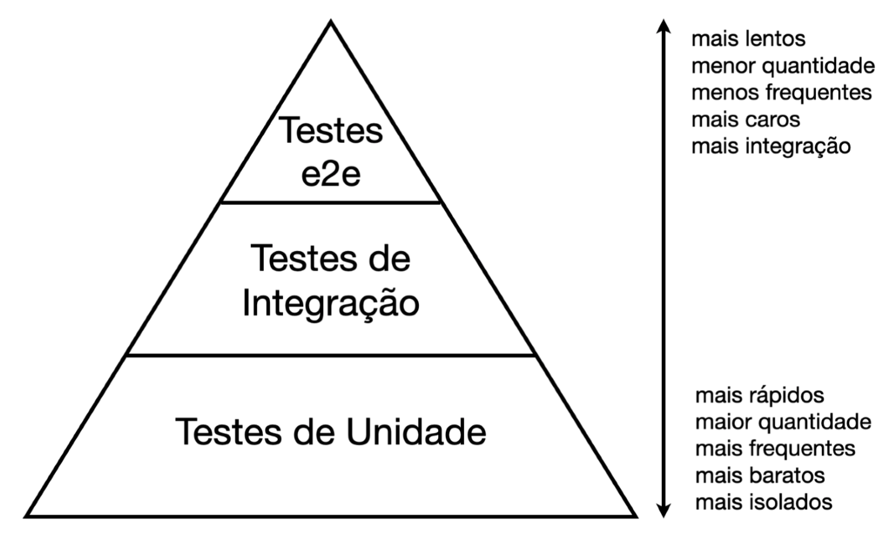
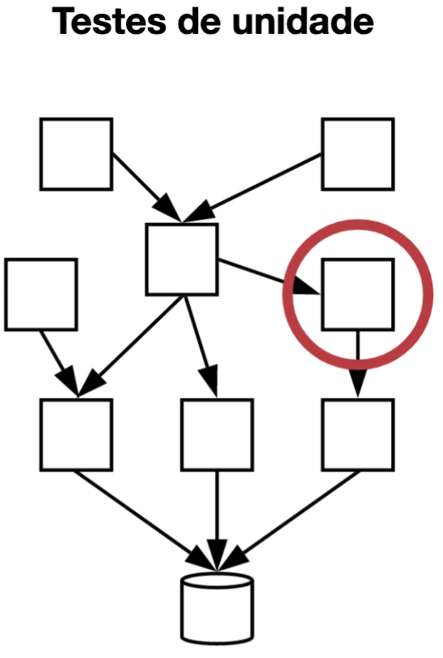
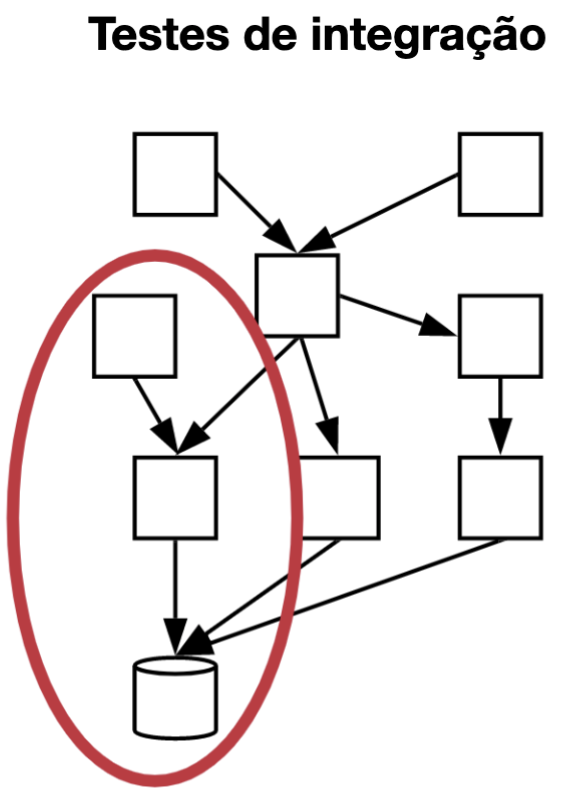
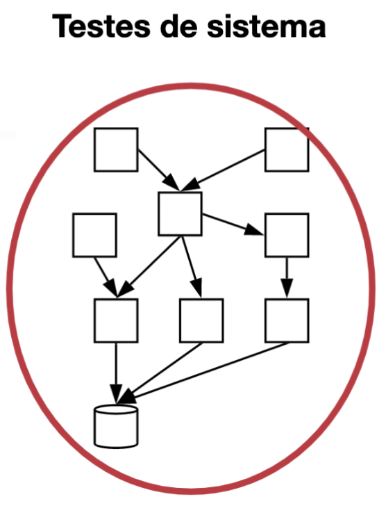
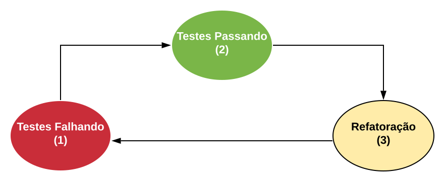

# Tópicos abordados

## Compilação X Execução e Linguagens tipadas

- Tempo de Compilação X Tempo de Execução
  - Compilar: criar executável
  - Executar: transformação em linguagem de máquina e execução do programa
  - [Referência](https://www.baeldung.com/cs/runtime-vs-compile-time#:~:text=Compile%20time%20is%20the%20period,generally%20occurs%20after%20compile%20time.)
- Linguagens tipadas: pontos positivos X negativos
  - Negativos:
    - Acostumar com uso e combinação de tipos
  - Positivos:
    - Checagem estática de erros/tipos
    - Argumentos de funções bem-definidos
    - Funciona como um tipo de documentação do código
  - Typescript:
    - [Tipos mais comuns em Typescript](https://www.typescriptlang.org/docs/handbook/2/everyday-types.html)
    - Arquivos de Typescript são compilados automaticamente para Javascript

Exemplo de código suscetível a comportamento indesejado em Javascript:

```js
function add(a, b) {
    return a + b
}

console.log(add(1, 2)) // adiciona
console.log(add(1, "2")) // concatena
console.log(add("Bruno ", "Oliveira")) // concatena
```

Implementação do código acima em Typescript, removendo o comportamento indesejado:

```js
function add(a: number, b: number) {
    return a + b
}

add(1, 2) // adiciona
add("1", 2) // ERRO em tempo de compilação
add("Bruno ", "Oliveira") // ERRO em tempo de compilação
```

- Operadores lógicos
  - AND (&&)
  - OR (||)
  - Existem diversos outros
  - [Referência](https://dicasdeprogramacao.com.br/operadores-logicos/#:~:text=Os%20operadores%20l%C3%B3gicos%20s%C3%A3o%3A%20E,E%20N%C3%83O%2DOU%2DEXCLUSIVO.)

## Iniciando projeto com Typescript

Siga os passos a seguir para instalação das dependências necessárias.  
Recomenda-se utilizar sistema Linux ou macOS.

- Instalar `nvm` (Node Version Manager):
  - [Referência para instalação](https://github.com/nvm-sh/nvm#installing-and-updating)
  - Executar comando `nvm -v` para verificar instalação
- Instalar [Node.js](https://nodejs.org/en/about/) utilizando `nvm`:
  - Executar comando `nvm install node`
  - Executar comando `node -v` para verificar instalação
  - Executar comando `npm -v` para verificar instalação
- Instalar Typescript globalmente:
  - Executar comando `npm i -g typescript`
  - Executar comando `tsc -v` para verificar instalação
- Instalar [Yarn](https://yarnpkg.com/) globalmente:
  - Executar comando `npm i -g yarn`
  - Executar comando `yarn -v` para verificar instalação

Após ter instalado essas ferramentas, na raiz desse repositório faça os seguintes passos:

- Execute `yarn init` e aguarde a inicialização (diversos arquivos serão criados)
- Execute `yarn add --dev typescript`
- Execute `tsc --init` para criar arquivo de configuração do Typescript no projeto.
  - Altere as configurações desse arquivo descomentando linhas ou alterando valores para que os seguintes campos estejam presentes:

```json
{
    "compilerOptions": {
        "outDir": "dist",
        "allowJs": true,
        "noImplicitAny": true,
        "strictNullChecks": true,
        "resolveJsonModule": true,
        "noImplicitReturns": true,
        "esModuleInterop": true,
        "target": "es6",
        "module": "commonjs",
        "baseUrl": "src",
    },
    "include": [
        "./src/**/*"
    ],
    "exclude": [
        "node_modules"
    ]
}
```

## GitHub, git e Tipos de Typescript

- git
  - Principais comandos:
    - pull: Puxa atualizações do repositório remoto (GitHub) para o repositório local
    - fetch: Usado para atualizar conteúdos locais com base no repositório remoto (atualiza branches existentes)
    - add: Adiciona arquivos a serem commitados
    - commit: Commita os arquivos adicionados, preferencialmente com uma mensagem descritiva
    - push: Envia os commits locais ao repositório remoto (GitHub)
    - checkout: Troca de branches
      - `git checkout -b <nome>` cria uma nova branch com o nome informado
- GitHub
  - Boas práticas de commits e PRs
    - Commits:
      - Mensagens curtas e descritivas
      - Quebras do trabalho feito em commits distintos (não fazer um commit "geral")
      - [Referência sobre padrão das mensagens de commit](https://www.conventionalcommits.org/en/v1.0.0/)
    - PRs
      - Descrição das mudanças realizadas
      - Passo-a-passo de como testar
      - Listar possíveis impactos causados pelas modificações/inclusões
      - Não dar merge em PRs que não foram revisados por outras pessoas
  - Source Control do VSCode e/ou GitHub Desktop podem facilitar:
    - Criação de novas branches
    - Selecionar arquivos de cada commit
    - Criação e revisão de PRs

- Tipos comuns utilizados em Typescript
  - Arquivo `common-types.ts` dessa pasta contém diversos exemplos
  - A [documentação oficial da linguagem](https://www.typescriptlang.org/docs/handbook/2/everyday-types.html) contém descrições, detalhes e casos de uso

## Generics, Utility Types e Function Overloads

- Utility Types:
  - Tipos "especiais" do Typescript
  - Utilizados para facilitar a transformação de tipos
  - Arquivos `omit.ts` e `partials.ts` contém exemplos de uso
  - Todos os utility types podem ser consultados [nessa documentação](https://www.typescriptlang.org/docs/handbook/utility-types.html)

- Generics:
  - Permite criação de componentes que funcionam com vários tipos distintos
  - Interessante por possibilitar reusabilidade
  - É melhor do que usar o tipo `any`
    - Com o tipo `any` não é possível saber o que será retornado por uma função, por exemplo
  - Arquivo `generics.ts` contém exemplo de uso
  - Mais detalhes sobre generics podem ser encontrados [nessa documentação](https://www.typescriptlang.org/docs/handbook/2/generics.html)

- Function Overloads:
  - Por vezes, queremos que uma mesma função funcionar com tipos e quantidades diferentes de argumentos, ou que tenha tipos diferentes de retorno
  - A primeira abordagem que vem em mente é criar funções distintas, que recebem parâmetros e têm retornos diferentes
  - O uso de Function Overloads facilita isso, e torna desnecessária a criação de diversas funções:
    - Cria a função "principal", com os argumentos a serem recebidos e o tipo a ser retornado
    - Para cada diferente retorno/argumentos desejados, cria-se apenas o cabeçalho da função
    - Com isso, dependendo dos argumentos passados e do tipo de retorno, a chamada da função será adaptada para utilizar a função principal ou algum dos cabeçalhos definidos
  - Exemplo:

```js
function makeDate(timestamp: number): Date; // Cabeçalho 1
function makeDate(m: number, d: number, y: number): Date; // Cabeçalho 2
function makeDate(mOrTimestamp: number, d?: number, y?: number): Date { // Função principal
  if (d !== undefined && y !== undefined) {
    return new Date(y, mOrTimestamp, d);
  } else {
    return new Date(mOrTimestamp);
  }
}

const d1 = makeDate(12345678); // Interpretado como Cabeçalho 1
const d2 = makeDate(5, 5, 5); // Interpretado como Cabeçalho 2
const d3 = makeDate(1, 3); // Interpretado como Função principal
```

## Jest, Prettier e Atualizando dependências de um projeto

- Jest
  - Framework de testes para Javascript/Typescript
  - [Documentação oficial](https://jestjs.io/pt-BR/docs/getting-started)
  - **Para esse projeto** podemos executar todos os testes com o comando `yarn test`
    - Para executar testes de um arquivo específico: `yarn test -- <nome do arquivo de testes>` dentro da pasta `/src`
    - Exemplo: `yarn test -- revert.test.ts`

- Prettier
  - Formatador de código configurável
  - Pode-se definir formatações padrão de um projeto criando um arquivo de configuração do Prettier
    - Esse arquivo pode ter diferentes formatos, como: `.prettierrc`, `prettierrc.json` e `prettier.config.js`
  - Ideal para manter boas práticas e padrões em um projeto
    - Espaçamentos iguais
    - Uso de ";"
    - Tamanho máximo de caracteres por linha
    - Etc
  - [Documentação oficial](https://prettier.io/docs/en/index.html)
  - **Para esse projeto** podemos executar o Prettier com o comando `yarn prettier`

- Atualizando dependências de um projeto
  - Em projetos com vários desenvolvedores, acontece de um deles instalar alguma dependência necessária para o que está desenvolvendo
    - Alguma lib com novas funcionalidades, um framework de testes como Jest, um formatador de código como Prettier
  - Para que o projeto funcione normalmente para todos os contribuidores, é necessário atualizar as dependências:
    - `yarn install`
    - Esse comando instala/atualiza todas as dependências de projetos em JS/TS listadas no arquivo `package.json`

## Loops, Arrays e Strings

### Loops (Laços)

- Possibilitam uma maneira fácil e rápida de executar uma ação repetidas vezes
- O laço mais utilizado é o `for`, mas existem outros como `while` e `do ... while`
- Laços são comumente utilizados com arrays, objetos ou strings. Esse uso será abordado nos próximos tópicos.
- Utilizando `for`:
  - O loop é repetido até que a condição especificada seja falsa
  - A declaração desse loop tem a seguinte forma: `for ([expressaoInicial]; [condicao]; [incremento])`, onde:
    - A `expressãoInicial` é inicializada e, caso possível, é executada. Normalmente essa expressão inicializa um ou mais contadores, mas a sintaxe permite expressões de qualquer grau de complexidade. Podendo conter também declaração de variáveis.
    - A `condicao` é avaliada. caso o resultado de `condicao` seja verdadeiro, o laço é executado. Se o valor de `condicao` é falso, então o laço terminará. Se a expressão `condicao` é omitida, a `condicao` é assumida como verdadeira (loop infinito).
    - O conteúdo dentro do `for` é, então, executado. Para executar múltiplas declarações, use uma declaração em bloco ({ ... }) para agrupá-las.
    - A atualização do `incremento`, se houver, executa, e volta-se para o passo de avaliar a `condicao`.

```js
for (let passo = 0; passo < 5; passo++) {
  // Executa 5 vezes, com os valores de passos de 0 a 4.
  console.log('Ande um passo para o leste');
}
```

- Outras duas funcionalidades úteis dentro de loops são as chamadas de `break` e `continue`
- `break`:
  - Utilizado para terminar um loop, isto é, fazer com que a execução do loop seja encerrada.
  - Útil em situações como procurar por um elemento ou valor específico e, quando encontrado, não há mais necessidade de continuar no loop.

```js
let contador = 0
for (let i = 0; i < 10; i++) {
  if (contador >= 15) {
    console.log("Contador possui valor maior ou igual a 15!")
    break;
  }
  contador += i
}
```

- `continue`:
  - Utilizado para passar para a próxima iteração de um loop, ignorando o que é feito após a declaração de `continue`.
  - Útil em situações nas quais se quer fazer um tratamento para elementos específicos de um array, e ignorar os demais elementos.

```js
for (let i = 0; i < 6; i++) {
  if (i < 3) {
    continue;
  }
  console.log("Esse número é maior que três: ", i)
}
```

**A referência completa sobre laços e iterações pode ser encontrada [nessa documentação](https://developer.mozilla.org/pt-BR/docs/Web/JavaScript/Guide/Loops_and_iteration#declara%C3%A7%C3%A3o_continue).**

### Arrays

- É uma lista com zero ou mais elementos, representada por `[]`;
  - `['Maçã', 'Banana']`
  - `[1, 2, 3, 4, 5]`
  - `[false, true, true]`
  - `["Maçã, 1 ,2, false]`
- Pode-se descobrir o tamanho de um array utilizando a função `length`:

```js
let frutas = ['Maçã', 'Banana']
console.log(frutas.length) // 2
```

- Itens de um array podem ser acessados utilizando seu index:
  - O index vai de 0 (primeiro elemento) até length - 1 (último elemento).

```js
let frutas = ['Maçã', 'Banana']
console.log(frutas[0]) // Maçã
console.log(frutas[1]) // Banana
console.log(frutas[frutas.length - 1]) // Banana
```

- Podemos iterar por um array utilizando loops:
  - Ideal para fazer alguma lógica que envolve todos os elementos do array, como achar um elemento específico, filtrar elementos ou alterar elementos.

```js
let a = ["Maçã", "Banana", "Uva", "Abacaxi"]
let theValue = "Uva"
for (let i = 0; i < a.length; i++) {
  if (a[i] == theValue) {
    console.log("Uva está na lista de frutas!")
    break;
  }
}
```

- Em JS/TS arrays possuem a função `forEach`, que é uma simplificação do loop `for` descrito no exemplo acima:

```js
let a = ["Maçã", "Banana", "Uva", "Abacaxi"]
a.forEach((item, indice) => {
  console.log(item, indice)
})
// Maçã 0
// Banana 1 
// Uva 2
// Abacaxi 3 
```

- Podemos inserir e remover elementos de um array utilizando algumas funções desse tipo de estrutura:
  - `push`: Adiciona item no final do array
  - `pop`: Remove (e retorna) item do final do array
  - `unshift`: Adiciona item no início do array
  - `shift`: Remove item do início do array

```js
let frutas = ['Maçã', 'Banana']
let adicionarFinal = frutas.push('Laranja');
// ['Maçã', 'Banana', 'Laranja']
let ultimo = frutas.pop(); // remove Laranja (do final)
// ['Maçã', 'Banana'];
let adicionarInicio = frutas.unshift('Morango') // adiciona ao início
// ['Morango', 'Banana'];
var primeiro = frutas.shift(); // remove Maçã do início
// ['Banana'];
```

**A referência completa sobre arrays e outras de suas funções pode ser encontrada [nessa documentação](https://developer.mozilla.org/pt-BR/docs/Web/JavaScript/Reference/Global_Objects/Array).**

### Strings

- Em qualquer linguagem de programação, é uma sequência de caracteres que representa um texto.
- Strings em JS/TS possuem diversas funções úteis que nos permitem manipular essas estruturas mais facilmente. Alguns exemplos:
  - [charAt](https://developer.mozilla.org/pt-BR/docs/Web/JavaScript/Reference/Global_Objects/String/charAt): Retorna o caractere da posição informada.
  - [endsWith](https://developer.mozilla.org/pt-BR/docs/Web/JavaScript/Reference/Global_Objects/String/endsWith): Indica se uma string termina com os caracteres informados, retornando um booleano.
  - [replace](https://developer.mozilla.org/pt-BR/docs/Web/JavaScript/Reference/Global_Objects/String/replace): Retorna uma nova string, substituindo a primeira ocorrência dos caracteres "antigos" dados como parâmetro pelos "novos".

```js
// charAt
let anyString = 'Brave new world'
console.log(anyString.charAt(0)) // B
console.log(anyString.charAt(2)) // a

// endsWith
let str = 'Ser ou não ser, eis a questão'
console.log(str.endsWith('questão')) // retorna true
console.log(str.endsWith('ser'))     // retorna false
console.log(str.endsWith('ser', 14)) // retorna true, nesse caso considera apenas os 14 primeiros caracteres da string

// replace
let anotherStr = "um dois três quatro seis seis"
console.log(anotherStr.replace("seis", "cinco")) // 'um dois três quatro cinco seis'
```

**Uma lista completa dessas funções pode ser encontrada [nessa documentação](https://developer.mozilla.org/pt-BR/docs/Web/JavaScript/Reference/Global_Objects/String)**

- Strings podem ser vistas como um array de caracteres
- Isso é importante pois:
  - Podemos iterar por uma string usando loops
  - Podemos saber o tamanho de uma string utilizando a propriedade `length`
  - Podemos acessar o valor de um caractere na string utilizando a notação `[index]`

```js
let nome = "Uva"
for (let i = 0; i < nome.length; i++) {
  console.log(nome[i])
}
// U
// v
// a
```

## Testes

[Referência](https://engsoftmoderna.info/cap8.html)

### Motivação

- Sistemas de software são complexos (milhares de linhas de código, métodos, classes, etc.)
- Todo software evolui para acomodar mudanças
- Manutenção e evolução de um software podem inserir erros ou comportamentos inesperados

Com isso, para evitar que problemas ocorram e chegem nos usuários finais, é fundamental introduzir atividades de testes de software.
Alguns dos benefícios dessa prática são:

- Prevenção de erros
  - Bons testes ajudam na detecção de bugs mais cedo no ciclo de desenvolvimento
  - Verificam tanto os comportamentos triviais como exceções (corner cases)
  - **É válido lembrar: por melhor que sejam os testes, eles não garantem que o sistema está livre de bugs.** Geralmente o espaço de possíveis entradas para testes é muito grande, não sendo possível testar todas as possibilidades
- Aumento da produtividade
  - Com um conjunto de testes bem estruturado, devs podem alterar o software com mais confiança (suporte à capacidade de mudança)
  - Testes são úteis também como documentação do código
  - Facilitam a revisão e depuração, permitindo releases mais rápidas e com mais qualidade
- Melhora do projeto do sistema
  - Quando o código é difícil de ser testado, isso é um indicativo que o código possui algum problema de projeto
    - Muitas dependências: difícil testar, pois tais dependências também devem ser criadas dentro dos testes, tornando-os mais complexos
    - Múltiplas responsabilidades: testes serão mais genéricos e menos focados para cobrir as diversas responsabilidades existentes

### Tipos

Nesse tópico serão tratados os principais tipos de testes **automatizados.** Testes manuais são lentos, caros e suscetíveis a falhas (uma vez que são realizados manualmente), logo são menos utilizados no dia-a-dia do que testes automatizados.
Os testes automatizados, por sua vez, são pequenos programas que chamam outros programas que desejamos testar e verificam se eles retornam os valores esperados, tendo como grande vantagem a possibilidade de serem executados diversas vezes devido à sua velocidade de execução.



- Testes de Unidade
  - Verificam automaticamente pequenas unidades do código (métodos, classes, etc.)
  - São os testes mais comuns em um sistema
  - Devem ser pequenos, estáveis, simples de escrever e ter baixo tempo de execução



- Testes de Integração
  - Verificam a interação entre componentes ou uma funcionalidade completa do sistema (separada da UI)
  - Usualmente envolvem comunicação com serviços externos (APIs, bancos de dados, sistemas de arquivos)
  - Mais lentos, caros e menos frequentes que testes de unidade



- Testes de Sistema (e2e)
  - Simulam o uso do sistema por usuários reais
  - São normalmente realizados na UI do sistema
  - Mais lentos, caros e menos frequentes que testes de integração



### Princípios FIRST

FIRST é um acrônimo de cinco características que testes de unidade devem possuir:

- **F**ast (Rápidos):
  - Testes de unidade devem ser executados frequentemente para obtenção rápida de feedback (s ou ms)
  - Caso existam testes mais demorados, é ideal a divisão do conjunto de testes em dois grupos: os que são executados rapidamente e os mais demorados
- **I**ndependent (Independentes):
  - A ordem de execução dos testes de unidade não deve influenciar nos resultados dos testes
- **R**epeatable (Determinísticos):
  - Testes de unidade devem sempre ter o mesmo resultado, de forma a garantir que de bugs introduzidos no código serão devidamente identificados
  - Testes não-determinísticos são conhecidos como *Flaky* (ou Erráticos)
- **S**elf-checking (Auto-verificáveis):
  - Resultados de testes de unidade devem ser facilmente verificáveis
  - Não é ideal que um desenvolvedor tenha que abrir e analisar arquivos de saída dos testes ou fornecer dados manualmente
- **T**imely (Escritos o quanto antes):
  - Quanto mais cedo no desenvolvimento de um projeto os testes de unidade sejam escritos, é mais provável que o sistema possua testes significativos e que validam uma maior parcela do sistema e de suas funcionalidades

### TDD

No Desenvolvimento Dirigido por Testes (*Test Driven Development* - TDD) o desenvolvedor primeiramente escreve o teste de unidade da classe ou método que será implementado, e só depois implementa a classe/método. Esse modelo de desenvolvimento é interessante pois:

- Ajuda a evitar que desenvolvedores esqueçam de escrever testes
- Favorece a escrita de código com alta testabilidade
- É uma prática que também é relacionada com a melhoria do design de um sistema

O ciclo de desenvolvimento com TDD é dividido em três etapas:



- De acordo com esse diagrama, a primeira meta é chegar no estado vermelho, quando o teste ainda não está passando. Pode parecer estranho, mas o estado vermelho já é uma pequena vitória: ao escrever um teste que falha, o desenvolvedor pelo menos tem em mãos uma especificação da classe que ele precisará implementar em seguida. Ou seja, ele já sabe o que tem que fazer. Conforme já mencionamos, nesse estado, é importante que o desenvolvedor pense também na interface da classe que ele terá que implementar, colocando-se na posição de um usuário da mesma. Por fim, é importante que ele entregue o código compilando. Para isso, ele deve escrever pelo menos o esqueleto da classe sob teste, isto é, a assinatura da classe e de seus métodos
- Em seguida, a meta é alcançar o estado verde. Para isso, deve-se implementar a funcionalidade completa da classe sob teste; quando isso ocorrer, os testes que estavam falhando vão começar a passar. No entanto, pode-se dividir essa implementação em pequenos passos. Talvez, nos passos iniciais, o código estará funcionando de forma parcial, por exemplo, retornando apenas constantes. Isso ficará mais claro no exemplo que daremos a seguir
- Por fim, deve-se analisar se existem oportunidades para refatorar o código da classe e do teste. Quando se usa TDD, o objetivo não é apenas alcançar o estado verde, no qual o programa está funcionando. Além disso, deve-se verificar a possibilidade de melhorar a qualidade do projeto do código. Por exemplo, verificar se não existe código duplicado, se não existem métodos muito longos que possam ser quebrados em métodos menores, se algum método pode ser movido para uma classe diferente, etc. Terminado o passo de refatoração, podemos parar ou então reiniciar o ciclo, para implementar mais alguma funcionalidade